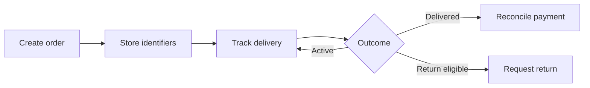

# Manage the order lifecycle

Use this workflow after your first successful API request. Detailed fields and response schemas remain in the endpoint reference, so this guide focuses on application behavior.

## 1. Create the consignment

Use [Create an order](../api/create-order.api.mdx) for a single parcel or [Create orders in bulk](../api/create-bulk-order.api.mdx) for a batch of up to 500 parcels.

Before sending a request:

- generate a unique `invoice` value;
- validate the recipient name, Bangladeshi phone number, and address;
- make sure `cod_amount` is zero or greater; and
- choose `delivery_type` `0` for home delivery or `1` for hub pickup.

## 2. Store the response identifiers

Persist these values with your local order:

| Value | Use |
| --- | --- |
| `invoice` | Your merchant-defined reference |
| `consignment_id` | Steadfast's numeric consignment identifier |
| `tracking_code` | Steadfast's parcel tracking code |

Keeping all three makes later reconciliation and support investigation easier.

## 3. Track delivery

Choose the endpoint that matches the identifier available to your application:

- [Track by invoice](../api/status-by-invoice.api.mdx)
- [Track by tracking code](../api/status-by-tracking-code.api.mdx)
- [Track by consignment ID](../api/status-by-consignment-id.api.mdx)

Store the latest returned state and map it using the [delivery status reference](../reference/delivery-statuses.md). Poll responsibly, and do not create another order merely because delivery is still pending.

## 4. Handle a return

When a consignment is eligible for return, submit its `consignment_id` through [Create a return request](../api/create-return-request.api.mdx). Record the request outcome with the original order.

## 5. Reconcile the account

Use [Get current balance](../api/get-current-balance.api.mdx) for the account balance and [List payments](../api/get-payments.api.mdx) for payment records. Reconcile those results against your stored invoices and consignments.

## Production practices

- Make order creation idempotent in your own application by locking or checking the invoice before submission.
- Log request IDs, invoice references, HTTP status codes, and response messages—but never credentials.
- Retry only temporary network or server failures with bounded exponential backoff.
- Send validation and authentication failures for correction instead of retrying them.
