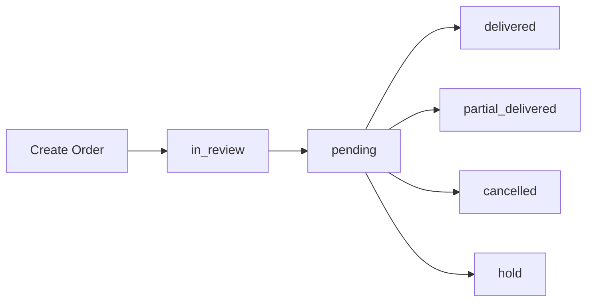

# Delivery Statuses

Every shipment progresses through different delivery statuses during its lifecycle.

---

## Status Reference

| Status | Description |
|---------|-------------|
| `in_review` | Order has been created and is waiting for review. |
| `pending` | Shipment is active but has not been delivered or cancelled yet. |
| `hold` | Shipment is currently on hold. |
| `delivered_approval_pending` | Delivered successfully and waiting for admin approval. |
| `partial_delivered_approval_pending` | Partially delivered and waiting for admin approval. |
| `cancelled_approval_pending` | Cancelled and waiting for admin approval. |
| `unknown_approval_pending` | Unknown pending status. Please contact support. |
| `delivered` | Successfully delivered and COD has been settled. |
| `partial_delivered` | Shipment was partially delivered and COD has been updated. |
| `cancelled` | Shipment has been cancelled and balance has been updated. |
| `unknown` | Unknown shipment status. Please contact support. |

---

## Order Lifecycle

---

## Status Flow

| Current Status | Next Possible Status |
|----------------|----------------------|
| `in_review` | `pending` |
| `pending` | `delivered`, `partial_delivered`, `cancelled`, `hold` |
| `hold` | `pending`, `cancelled` |
| `delivered` | Final |
| `partial_delivered` | Final |
| `cancelled` | Final |

---

## Best Practices

- Poll the Delivery Status API periodically instead of creating duplicate orders.
- Store the latest delivery status in your database.
- Treat `delivered`, `partial_delivered`, and `cancelled` as final states.
- Contact Steadfast support if you receive the `unknown` status.

---

## Related APIs

- Delivery Status API
- Create Order API
- Bulk Create Order API
- Payments API